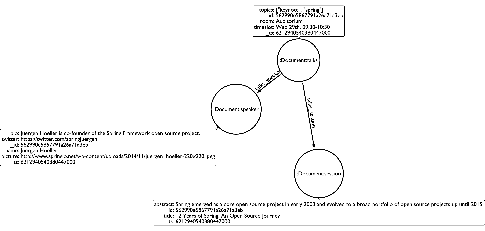

= Neo4j Doc Manager
Neo4j Team <michael.hunger@neotechnology.com>
v1.0, 2015-08
:toc:
:toclevels: 6

:sectnums:

== Our Goal

Neo4j is an OLTP graph database which excels at querying data relationships, which is a weakness of other NoSQL and SQL solutions.  We created the Neo4j Doc Manager for the Mongo Connector to allow MongoDB developers to store JSON data in Mongo while querying the relationship between the data using Neo4j.  We call this polyglot persistence - using the database best suited for the type of data and querying your application requires.

MongDB stores data as JSON documents, while Neo4j stores data as graphs.  In order to enable graph-based querying of Mongo data, we need to determine how to map between these two different data structures.  Our initial goal was to implement a default mapping plan, covering the most well-known cases. We wanted to follow convention instead of requiring configuration. We collected some generic Mongo Document structures based on community feedback and structured the mapping based on them. It's important to note that we are opened for further suggestions and improvements.

image::resources/images/doc_to_graph.png[]

This project is based upon the link:https://github.com/10gen-labs/mongo-connector[Mongo Connector]. It provides a simple protocol to transfer data from MongoDB to another database. While Mongo publishes Doc Manager implementations for other databses, they did not provide an implementation for Neo4j.  You can grab more detailed information about **mongo-connector** into the official link:https://github.com/10gen-labs/mongo-connector/wiki[Project Wiki].

The Mongo Connector requires creating a MongoDB link:http://docs.mongodb.org/manual/tutorial/deploy-replica-set/[replica set]. An **OplogThread** thread then will listen to all CUD actions occurring in MongoDB. The **mongo-connector** provides an interface to collect the events caught by the OplogThread. The communication interface is implemented into a structure called **DocManager**, which can properly receive and handle Mongo documents and information about the database and its collections.

By extending the **DocManager** class, we have created a Configuration that interacts with Neo4j. Some methods are required to be implemented to keep Mongo Connector protocol consistent. The next section describes in detail how **neo4j_doc_manager** handles each of these methods.

Detailed documentation for the *DocManager* superclass and its protocol can be found link:https://github.com/10gen-labs/mongo-connector/wiki/Writing-Your-Own-DocManager[here]

== About Neo4j DocManager

=== Setup

==== Install neo4j-doc-manager

The preferred method of installation is with the pip package manager:

```
pip install neo4j-doc-manager --pre
```

===== Alternate installation

If you experience any issues with pip you may use the following installation method:

First of all, install link:https://github.com/10gen-labs/mongo-connector[mongo-connector]. This can be easily done with the following command:

```
pip install mongo-connector
```

Now install **neo4j_doc_manager** by cloning this repository and setting the `PYTHONPATH` to it's local directory:

```
git clone https://github.com/neo4j-contrib/neo4j_doc_manager.git
cd neo4j_doc_manager
export PYTHONPATH=.
```

You also must install **py2neo**:

```
pip install py2neo
```

==== Start Neo4j and Mongo

Ensure that you have a Neo4j instance up and running.

If you have authentication enabled for Neo4j, be sure to set **NEO4J_AUTH** environment variable, containing your user and password. 

```
export NEO4J_AUTH=<user>:<password>
```

Ensure that mongo is running a *replica set*. To initiate a replica set start mongo with:

```
mongod --replSet myDevReplSet
```

Then open link:http://docs.mongodb.org/master/tutorial/getting-started-with-the-mongo-shell[mongo-shell] and run:

```
rs.initiate()
```

Please refer to link:https://github.com/10gen-labs/mongo-connector/wiki/FAQ[Mongo Connector FAQ] for more information.


==== Start the Neo4j Doc Manager service

To start the service, run the following command:

```
mongo-connector -m localhost:27017 -t http://localhost:7474/db/data -d neo4j_doc_manager
```

* **-m** provides Mongo endpoint
* **-t** provides Neo4j endpoint. Be sure to specify the protocol (http).
* **-d** specifies Neo4j Doc Manager.


=== Methods

==== Constructor

By invoking **Neo4j Doc Manager** initialisation command with proper parameters ( `mongo-connector -m [mongo_url] -t [neo4j_server_url] -d neo4j_doc_manager` ), the **Neo4jDocManager** constructor is called.

Constructor receives the following arguments:
[source, python]
----
(self, url, auto_commit_interval=DEFAULT_COMMIT_INTERVAL,
                 unique_key='_id', chunk_size=DEFAULT_MAX_BULK, **kwargs)

----

**url** corresponds the address where a Neo4j server instance is running.

**unique_key** corresponds to the identifier refers to the unique key that is being used in Mongo. Default value is *_id* .

===== Authentication

==== Upsert

Upsert consists into the method that creates new nodes and relationships given a Mongo Document. The method signature is described as below:
[source, python]
----
upsert(self, doc, namespace, timestamp):
----

Basically we **translate every element of a collection into a new node**. Since the elements can be composite, we have adopted some patterns to properly convert each document into a group of nodes and relationships:

* Each new node will be receive *Document* Label
* Also the document type (the referred collection from the incoming document) will also be inserted as a node label
* Document id will be propagated to the node. That means node will have the same '_id' that Mongo Document has.
* If the document contains the elements below, they will recursively be transformed into new nodes as well
  ** a nested document
  ** an array of documents
* All the other types of data into the document will be translated into node properties.

In terms of relationships, every time we find composite documents, we will stablish a relationship between the root document and the nested document.

To clarify our scenario, let's imagine an empty MongoDB instance.
Let's also consider an empty instance of Neo4j.

===== Simple case

We then run the following statement into *mongo*, to insert a talk into a collection of talks:

[source]
----
db.talks.insert(  { "session": { "title": "12 Years of Spring: An Open Source Journey", "abstract": "Spring emerged as a core open source project in early 2003 and evolved to a broad portfolio of open source projects up until 2015." }, "topics":  ["keynote", "spring"], "room": "Auditorium", "timeslot": "Wed 29th, 09:30-10:30", "speaker": { "name": "Juergen Hoeller", "bio": "Juergen Hoeller is co-founder of the Spring Framework open source project.", "twitter": "https://twitter.com/springjuergen", "picture": "http://www.springio.net/wp-content/uploads/2014/11/juergen_hoeller-220x220.jpeg" } } );
----

This will insert the following document into Mongo:
[source, json]
----
{
  "session": {
    "title": "12 Years of Spring: An Open Source Journey",
    "abstract": "Spring emerged as a core open source project in early 2003 and evolved to a broad portfolio of open source projects up until 2015."
  },
  "topics":  ["keynote", "spring"], 
  "room": "Auditorium",
  "timeslot": "Wed 29th, 09:30-10:30",
  "speaker": {
    "name": "Juergen Hoeller",
    "bio": "Juergen Hoeller is co-founder of the Spring Framework open source project.",
    "twitter": "https://twitter.com/springjuergen",
    "picture": "http://www.springio.net/wp-content/uploads/2014/11/juergen_hoeller-220x220.jpeg"
  }
}
----

This will be reflected as follows into Neo4j:



**Created nodes:** 

* _Document:talks_ - talks is the root node, coming from Mongo Document Collection, with an id that also comes from MongoDB. Non nested Documents are converted into regular properties, such as "room", "topics" and "timeslot" (a common String array).
* _Document:session_ - Nested Document. Inner key/values are converted into Node properties. Note that the id incoming from root *talks* collection is propagated to this Node. Also, note that this node is labelled as its direct document key, in this case, *session*.
* _Document:speaker_ - also nested Document.

**Created Relationships:**

* A relationship that connects *talks* and *session* nodes, called **talks_session**,
* A relationship that connects *talks* and *speaker* nodes, called **talks_speaker**.

===== Case containing a JSON Array

Now let's insert the following data. Note the nested JSON array represented by **tracks**:
[source]
----
db.talks.insert(  { "session": { "title": "12 Years of Spring: An Open Source Journey", "abstract": "Spring emerged as a core open source project in early 2003 and evolved to a broad portfolio of open source projects up until 2015." }, "topics":  ["keynote", "spring"], "tracks": [{ "main":"Java" }, { "second":"Languages" }], "room": "Auditorium", "timeslot": "Wed 29th, 09:30-10:30", "speaker": { "name": "Juergen Hoeller", "bio": "Juergen Hoeller is co-founder of the Spring Framework open source project.", "twitter": "https://twitter.com/springjuergen", "picture": "http://www.springio.net/wp-content/uploads/2014/11/juergen_hoeller-220x220.jpeg" } } );
----

[source, javascript]
----
{
  "session": {
    "title": "12 Years of Spring: An Open Source Journey",
    "abstract": "Spring emerged as a core open source project in early 2003 and evolved to a broad portfolio of open source projects up until 2015."
  },
  "topics":  ["keynote", "spring"], 
  "tracks": [{ "main":"Java" }, { "second":"Languages" }],
  "room": "Auditorium",
  "timeslot": "Wed 29th, 09:30-10:30",
  "speaker": {
    "name": "Juergen Hoeller",
    "bio": "Juergen Hoeller is co-founder of the Spring Framework open source project.",
    "twitter": "https://twitter.com/springjuergen",
    "picture": "http://www.springio.net/wp-content/uploads/2014/11/juergen_hoeller-220x220.jpeg"
  }
}
----

The above document will be translated into Neo4j as follows:

**Created nodes:**

* _Document:talks_ - talks is the root node, coming from Mongo Document Collection, with an id that also comes from MongoDB. Non nested Documents are converted into regular properties, such as "room", "topics" and "timeslot" (a common String array).

* _Document:tracks0_ - A node that represents the first JSON of **tracks** array [at index 0]. It contains the propagated **talks** id, plus the properties of the nested document.
* _Document:tracks1_ - A node that represents the second JSON of **tracks** array [at index 1]. It contains the propagated **talks** id, plus the properties of the nested document.

* _Document:session_ - Nested Document. Inner key/values are converted into Node properties. Note that the id incoming from root *talks* collection is propagated to this Node. Also, note that this node is labelled as its direct document key, in this case, *session*.
* _Document:speaker_ - also nested Document.

**Created Relationships:**

* A relationship that connects *talks* and *session* nodes, called **talks_session**,
* A relationship that connects *talks* and *speaker* nodes, called **talks_speaker**.
* A relationship that connects *talks* and the first element of *tracks* array (_tracks0_), called *talks_tracks0*
* A relationship that connects *talks* and the second element of *tracks* array (_tracks1_), called *talks_tracks1*

===== Case containing Mongo documents joined by an _id reference

Let's imagine now an explicit *_id* reference between two documents, such as:

[source]
----
db.places.insert({"_id": "32434ab234324", "name": "The cool place", "url": "cool.example.net" })
----

[source, javascript]
----
{ 
  "_id": "32434ab234324", 
  "name": "The cool place", 
  "url": "cool.example.net" 
}
----

[source]
----
db.people.insert({ "name": "Michael", "places_id": "32434ab234324", "url": "neo4j.com/Michael" })
----

[source, javascript]
----
{
  "name": "Michael", 
  "places_id": "32434ab234324", 
  "url": "neo4j.com/Michael" 
}
----

Note that two documents were inserted, and *people* references *place* explicitly by *id*. __Neo4j Doc Manager__ will map every field that ends with ** \_id ** into an explicit relationship. First, we run a *MERGE* to see if the respective node exists. In the above example, we insert a _place_, and then a _people_. When inserting the _people_ type, the connector will identify an explicit _id_ relationship, through __places\_id__ , and will try to find the respective node. If it does exist (and it should), a relationship between the two nodes will be created.

**Created nodes:**

* _Document:places_ - Simple root node, with the properties _name_ and _url_ and an *_id*.
* _Document:people_ - Another node, that comes from an different _upsert_ method call. It creates another simple node, with the properties _name_ and _url_.

**Created Relationships:**

* A relationship that connects *people* and *places* nodes is created due to the property *places_id* on _people_ node. It is called **people_places**.

==== Update

Update consists into the method that will update information into a document, by modifying an existing property or adding a new one; to a single document or multiple ones. The behaviour varies according to the instruction passed to Mongo.

===== $set

*$set* clause updates a single document. For example, imagine we have inserted the _talks_ previourly described into _Upsert_ section, and now we want to update the *room*, which is *Auditorium*, to *Auditorium2*. We have to run the following instruction:

[source]
----
db.talks.update({ "room": "Auditorium"}, { $set: { "room": "Auditorium2"} })
----

This instruction will get the first document in Mongo that matches with the specified criteria and generate an update method call into _Neo4j Doc Manager_. Considering we have a document previously inserted into Mongo by the Upsert example, we will have a single update.

**Updated Nodes**

* The node with _room: "Auditorium"_ now will have the property _room_ with the value of _"Auditorium2"_.

Let's assume now another talk was added to Mongo:

[source]
----
db.talks.insert(  { "session": { "title": "First steps with React", "abstract": "A little about React and how helpful it can be to your projects." }, "topics":  ["keynote", "javascript"], "room": "Auditorium2", "timeslot": "Wed 29th, 10:30-11:30", "speaker": { "name": "Peter Hunt", "bio": "Senior Developer.", "twitter": "https://twitter.com/react_developer", "picture": "http://www.reactiospeakers.org/wp-content/uploads/2015/09/peter-220x220.jpeg" } } );
----

Note that both talks should be held at _Auditorium2_. If we run the following command:

[source]
----
db.talks.update({ "room": "Auditorium2"}, { $set: { "room": "Auditorium"} })
----

*Only the first document found by Mongo will be updated*. If we want to change all documents, we must use _multi_ parameter, described in the following section.

Many properties can be changed with a single _update_ clause. For example, if we run

[source]
----
db.talks.update({ "room": "Auditorium2"}, { $set: { "room": "Auditorium", "timeslot": "Wed 29th, 10:00-11:30" } })
----

We will have both properties, _room_ and _timeslot_, updated into the graph.

===== multi

We can update all the documents that match to a following criteria. Following the example above, to update all document _rooms_ to _Auditorium_, we should run:

[source]
----
db.talks.update({ "room": "Auditorium"}, { $set: { "room": "Auditorium2"} }, { multi: true } )
----

_multi: true_ will update all documents that match the specified clauses. This behaviour will also be reflected into Neo4j - all Nodes will be updated. So, if before the clause we had:

**Nodes**

* Two nodes with *room* setted to *Auditorium2*

After running the update clause with _multi_ parameter, we end up with:

** Updated Nodes**

* The two nodes now have _room_ setted for _Auditorium_.

===== Inserting new properties

Update clauses also can be used for inserting new properties into documents. This will impact into a new property for a node. Let's assume the _talks_ previously inserted. Let's set a _level_ property for all the talks that will happen into _Auditorium_ room, pointing that they require an _intermediate_ level. Before running the update clause, we have the following into Neo4j graph:

* Two nodes labelled as *Document:talks* without a _level_ property.

[source]
----
db.talks.update({ "room": "Auditorium"}, { $set: { "level": "intermediate"} }, { multi: true })
----

After running the update clause, we have:

* The same two nodes labelled as *Document:talks*, now with a _level_ property, containing _"intermediate"_ as its value.


===== Creating new documents by an update action

If the update clause does not match any document, by default a new document is not created. However, if you pass the parameter _{upsert: true}_, a new document is created. For example, assume we run the following clause:


[source]
----
db.talks.update({ "room": "Auditorium4"}, { $set: { "session": { "title": "Introduction to Neo4j", "abstract": "First steps with Neo4j, basic configuration and data modelling." }, "topics":  ["keynote", "databases"], "room": "Auditorium4", "timeslot": "Wed 29th, 13:30-14:30", "speaker": { "name": "Michael Hunger", "bio": "Senior Developer.", "twitter": "https://twitter.com/neo4j" } } })
----

At the moment we do not have any document that matches with _room_ _Auditorium4_. If we do not specify anything, nothing is done to Mongo or Neo4j. However, if we specify the _upsert_ as a _true_ parameter,

[source]
----
db.talks.update({ "room": "Auditorium4"}, { $set: { "session": { "title": "Introduction to Neo4j", "abstract": "First steps with Neo4j, basic configuration and data modelling." }, "topics":  ["keynote", "databases"], "room": "Auditorium4", "timeslot": "Wed 29th, 13:30-14:30", "speaker": { "name": "Michael Hunger", "bio": "Senior Developer.", "twitter": "https://twitter.com/neo4j" } } }, {upsert: true})
----

A new document will be inserted into Mongo and a new group of nodes and relationships will be inserted into Neo4j. SO, after running the above query, we will have:

** Update nodes **

None

**Inserted nodes**

* _Document:talks_ - a new node is created, with _room_ setted for _Auditorium4_ and timeslot as _Wed 29th, 13:30-14:30_.
* _Document:session_ - Node created from Nested Document.
* _Document:speaker_ - also nested Document.


==== Delete

It is possible to remove documents from MongoDB my calling ```db.[your_collection].remove()``` method. If you want to remove all the documents from **talks** collection, for example, you should call

```
db.talks.remove({})
```
So let's imagine that we had **two** nodes on talks, previously inserted. Each node has relationships and connected nodes:

* _Document:talks_ - talks is the root node, coming from Mongo Document Collection, with an id that also comes from MongoDB. Non nested Documents are converted into regular properties, such as "room", "topics" and "timeslot" (a common String array).
* _Document:session_ - Nested Document. Inner key/values are converted into Node properties. Note that the id incoming from root *talks* collection is propagated to this Node. Also, note that this node is labelled as its direct document key, in this case, *session*.
* _Document:speaker_ - also nested Document.
* A relationship that connects *talks* and *session* nodes, called **talks_session**,
* A relationship that connects *talks* and *speaker* nodes, called **talks_speaker**.


 By calling ```db.talks.remove({})```, we will remove all **talks** and their relationships and connected nodes. We end up with the removal of all elements listed above.

===== Removing relationships

When a node will be removed, the nodes created from nested documents will also be removed. Also, all the relationships between these nodes will be deleted, to avoid orphans.

===== Removing nodes with clauses

It is also possible to specify a document parameter that refers to the document that we want to remove. For example, we can run:

```
db.talks.remove( { room : "Auditorium" }, 1 )
```

This will remove a single document with **room** marked as **Auditorium**.

The translation will be held the same way for Neo4j - The corresponding **Document::talks** node will be removed with all his nested information.

